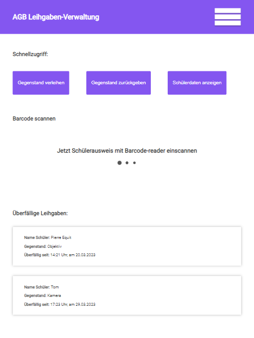
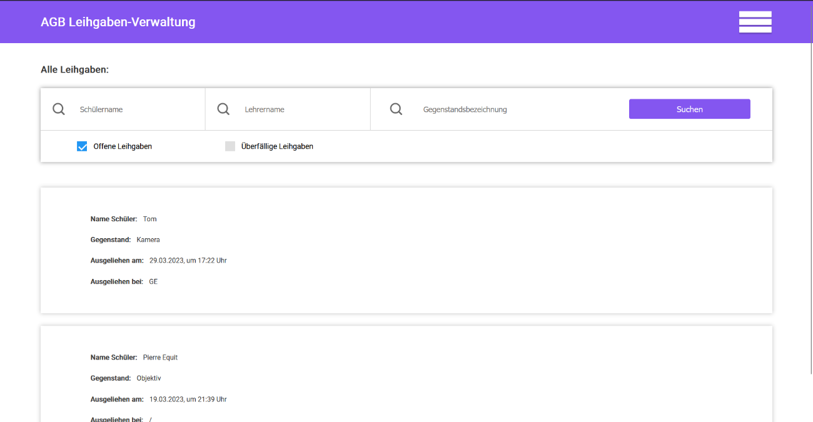

# AGB Leihgaben-Verwaltung

## Description

This project serves as a management program for the Abtei Gymnasium Brauweiler. It is intended to manage loaned items that are borrowed by students, for example, within the context of a project course. This system ensures that teachers have continuous access to all data (such as the student's name, borrowed item, loan period, etc.).

To facilitate this, a barcode is attached to every item loaned to students. Ideally, students are identified or registered using their student ID cards. If these are not available, there is an option to temporarily record the data manually. However, at the earliest convenience, these records should be updated using the student ID cards.

## Table of contents

1. [Prequisites](#prequisites)
2. [Installation](#installation)
3. [Usage and Examples](#usage-and-examples)
4. [The Value Added by Implementation in School](#the-value-added-by-implementation-in-school)
5. [Documentation](#documentation)
6. [Authors](#authors)
7. [Contact](#contact)
8. [Versions](#versions)

## Prequisites

- PHP version 8.1 is required, with the following extensions installed:
    - [intl](http://php.net/manual/en/intl.requirements.php)
    - [mbstring](http://php.net/manual/en/mbstring.installation.php)

- Additionally, make sure that the following extensions are enabled:
    - json (enabled by default - don't turn it off)
    - [mysqlnd](http://php.net/manual/en/mysqlnd.install.php)
    - [libcurl](http://php.net/manual/en/curl.requirements.php)

- MariaDB database
- Web server (e.g. Apache)
- When using Apache webserver make sure to enable mod_rewrite (`sudo a2enmod rewrite`, `sudo systemctl restart apache2`) and to enable the AllowOverride Apache setting (To give full access for htaccess, use `AllowOverride All` in your _httpd.conf_ file (in the \<Directory> section). See: [AllowOverride](https://httpd.apache.org/docs/2.2/mod/core.html#allowoverride)) 

## Installation

After installing the web server, PHP8.1 with the required extensions, and MariaDB, you will need to import the database structure from the provided SQL file ('AGB.sql') into your MariaDB database. This will create a database with all the required tables.

Next Copy `env` to `.env` (project-root), specify the baseURL and any database settings. The created database is called 'agb_ausleihen_db' and should be declared in the `.env`.

The index.php is inside the project-root/public folder. This means you should configure your web server to "point" to the *public* folder, and not to the project root.

## Usage and Examples

### Homepage

The homepage provides users with quick access to the most essential functions. Therefore, a teacher can directly scan a barcode, and the system will interpret it accordingly. If it is a barcode for an item, it will be marked as returned; if it is a student ID card, the system assumes that a new loan transaction is to be created for that student.

Furthermore, teachers also have the option, through the quick access feature, to loan or return an item. They can also view a student's information by scanning their student ID card.

Lastly, teachers can easily check if there are currently any overdue loan transactions and obtain more details by clicking on the respective notification.

So that students can borrow items, the student's ID card is scanned either directly on the homepage or in the menu under the 'Add' -> 'Create Loan' section.

Afterwards, the teacher is prompted to scan the barcode(s) of the item(s) to be loaned.

### Show Loan

All loan transactions can be found under the 'All Loans' section in the menu.

Here, teachers have the option to filter loan transactions by the student's name, the teacher's name, and/or the item's name. Additionally, they can choose to display only open loans or all loans. The same options apply to overdue loans.

By clicking on a specific loan transaction, more detailed information about the student and the item can be accessed. Additional details such as 'Borrowed on,' 'Due on,' 'Returned on,' and 'Borrowed by' are also available for review.

### Show registered students

Under the menu option 'Registered Students' a list of all students registered in the system can be displayed.

By clicking on a student's name in this list, you can view their current loans as well as a history of all the loans that person has made.

You can also edit the student's name and assign a student ID card. This function is primarily intended for temporarily registered students (those without a student ID card).

### Show registered Items

To view all registered items, you must navigate to the 'Registered Items' section in the menu.

For each item, you can view its name and barcode ID. Additionally, you can check whether the item is currently on loan and who has borrowed it. It is also possible to edit the name and barcode of the item, which is particularly useful in cases where the barcode has become detached from the item and is lost.

Furthermore, you have the option to check if any damages have been registered for an item and, if necessary, add new damage records. Finally, you can access the history of when and how often a particular student has borrowed the item. By clicking on the respective entry, you can access all information related to that loan transaction.

## The Value Added by Implementation in School

Currently, teachers are required to document all loan transactions on paper. This not only consumes a significant amount of time but also poses potential risks. Possible scenarios include the loss of the document listing which student from a project course, for instance, borrowed a camera. In the worst-case scenario, this would result in the inability to track who has not returned the borrowed camera.

The project addresses this issue by storing the data on a server, thereby enabling any authorized teacher to access and review all loan transactions at any given time. Furthermore, the program allows for data filtering, such as searching for items, student names, overdue items, etc.

An exceptional added value of this learning project lies in the reduction of unnecessary paper usage, thereby conserving a valuable resource (wood).

## Documentation

The project includes a german documentation, which was required, due to the project being a voluntary project for the school.

## Authors

Pierre Equit

## Contact

If you have any questions or issues, feel free to reach out to me at pierre.equit@gmail.com or open an issue.

## Versions

* 0.2.2
    * updated ci framework
    * fixed barcode-scan bug on homepage
* 0.2.1
    * cleaned and commented Helpers
    * Commented functions in ProcessAjax
    * Splited ProcessAjax and ProcessBarcode
* 0.2
    * Added readme file
* 0.1
    * Initial Release